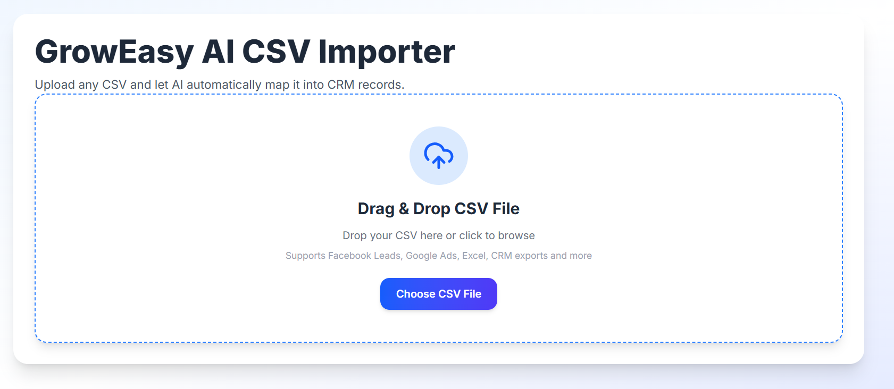
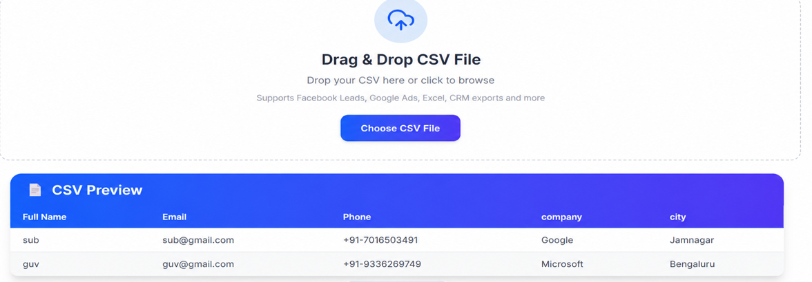
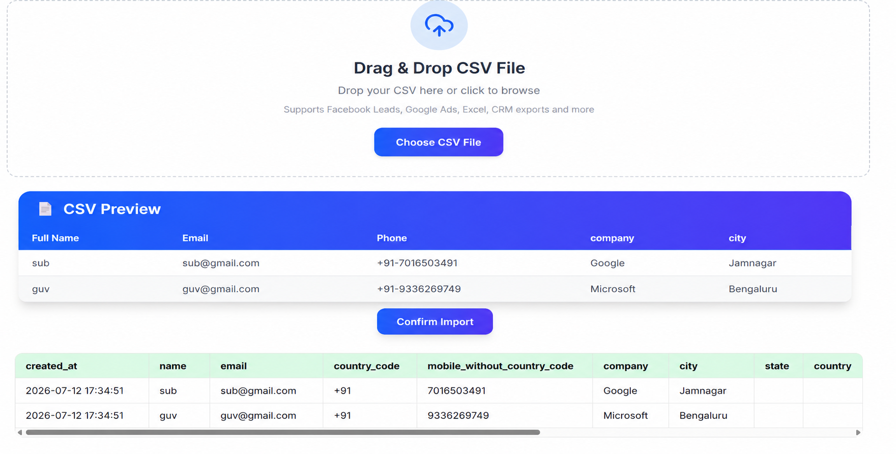

# GrowEasy AI CSV Importer

## Project Overview

This project is an AI-powered CSV Importer built for the GrowEasy Software Developer Assignment.

The application allows users to upload CSV files from different sources such as:

- Facebook Lead Ads
- Google Ads
- Excel Sheets
- Marketing Reports
- Real Estate CRM Exports
- Sales Reports

Instead of relying on fixed column names, the application uses Google's Gemini AI to intelligently identify and map CSV columns into the GrowEasy CRM schema.

---

## Features

- Upload CSV File
- Drag & Drop Upload
- CSV Preview
- Responsive Tables
- AI-powered CRM Field Extraction
- Batch Processing
- Skip Invalid Records
- Retry Mechanism
- TypeScript Support

---

## Tech Stack

### Frontend

- Next.js
- React
- TypeScript
- Tailwind CSS
- PapaParse
- Axios

### Backend

- Node.js
- Express
- TypeScript
- Multer
- PapaParse
- Gemini AI (@google/genai)

---

## Folder Structure

```
groweasy-ai-importer
│
├── frontend
│
└── backend
```

---

## Installation

### Backend

```bash
cd backend

npm install
```

Create a `.env` file:

```env
PORT=5000
GEMINI_API_KEY=YOUR_GEMINI_API_KEY
```

Start Backend:

```bash
npm run dev
```

---

### Frontend

```bash
cd frontend

npm install

npm run dev
```

Frontend URL

```
http://localhost:3000
```

Backend URL

```
http://localhost:5000
```

---

## How It Works

1. Upload CSV
2. Preview CSV
3. Click Confirm Import
4. Backend parses CSV
5. Gemini AI extracts CRM fields
6. CRM records are displayed

---

## AI Mapping

The application intelligently maps fields such as:

| CSV Column | CRM Field |
|------------|-----------|
| Full Name | name |
| Client Name | name |
| Email Address | email |
| Mail | email |
| Phone | mobile_without_country_code |
| Contact | mobile_without_country_code |
| Company | company |
| Organization | company |
| Remarks | crm_note |

---

## Environment Variables

Backend

```env
PORT=5000
GEMINI_API_KEY=YOUR_API_KEY
```

---

## Screenshots

Add screenshots here before submitting.

Example:

### Upload Page



### CSV Preview



### AI Result



---

## Author

Subham Kumar Sahani